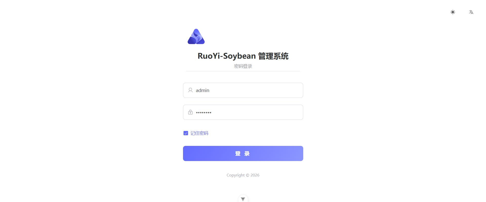
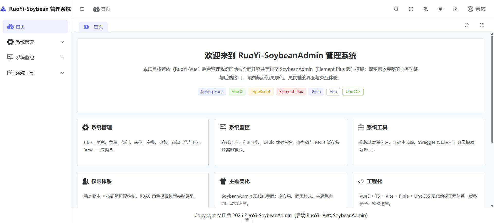
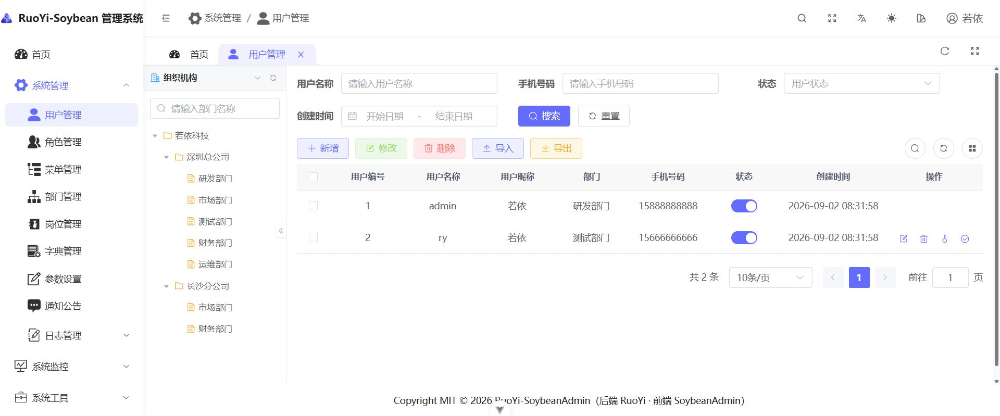
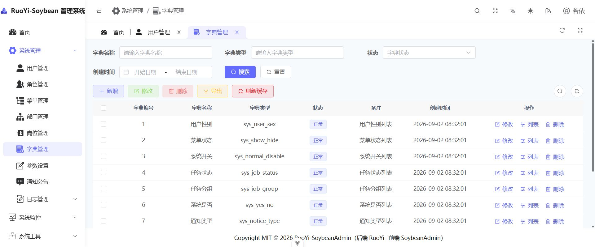
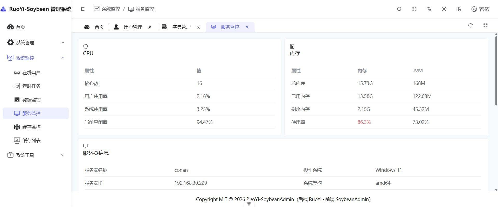
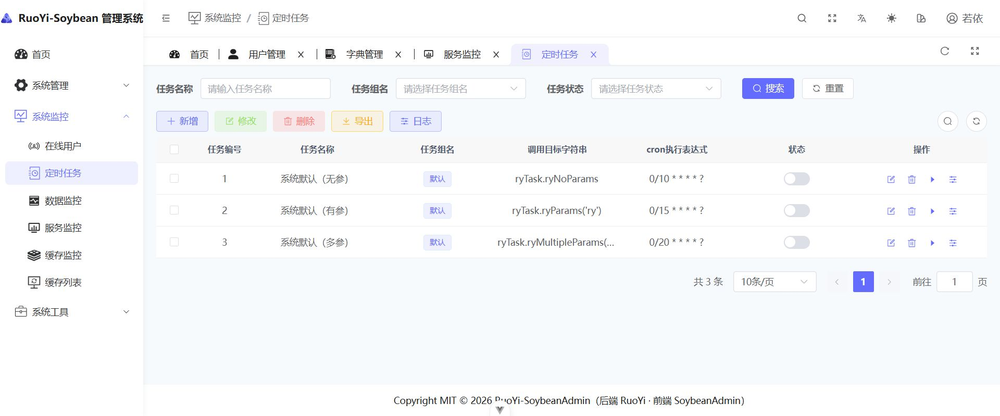
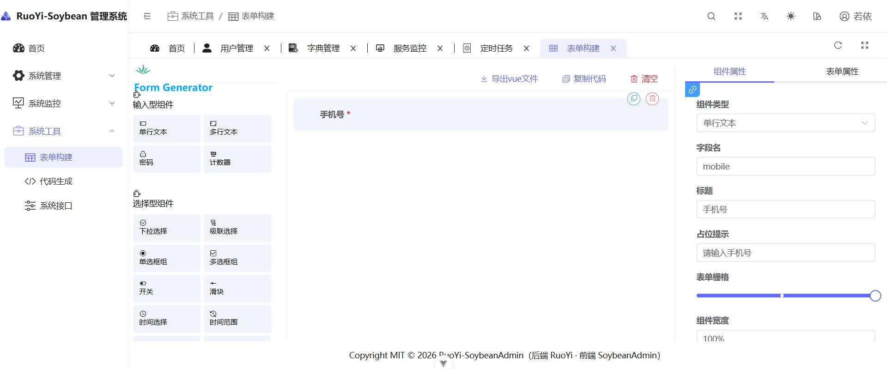
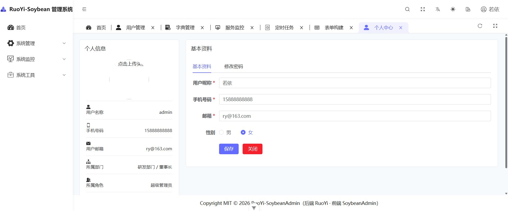

# RuoYi-SoybeanAdmin（springboot-soybeanadmin）

<p>
  
  
  
  
  
</p>

| 仓库地址 | 链接 |
| -------- | ---- |
| Gitee | https://gitee.com/zxenglish/springboot-soybeanadmin |
| GitHub | https://github.com/Zx357/SpringbootSoybeanadmin |

## 平台简介

**一句话：把若依框架的前端"美化"了一遍。**

若依（RuoYi-Vue）是国内流行的后台管理框架，功能完善但界面朴素。本项目在**后端零改动**的前提下，将其前端整体迁移并美化至 [SoybeanAdmin](https://github.com/soybeanjs/soybean-admin)（Element Plus 版）模板：

- 后端直接使用若依官方 Spring Boot 工程，接口、数据库、权限体系原样保留
- 前端采用 Vue3 + TypeScript + Vite + Pinia + UnoCSS 现代工程体系
- 若依全部功能页面**逐页迁移、逐页实测**，业务能力不缩水
- 界面全面焕新：多布局模式、暗黑模式、主题色定制、精致多标签页

## 内置功能

- **系统管理**：用户管理（部门树 + 左右布局）、角色管理、菜单管理、部门管理、岗位管理、字典管理、参数设置、通知公告、操作日志、登录日志
- **系统监控**：在线用户（强退）、定时任务（含调度日志）、数据监控（Druid）、服务监控（CPU/内存/JVM/磁盘）、缓存监控、缓存列表
- **系统工具**：表单构建（拖拽设计）、代码生成（导入表 / 编辑配置 / 预览下载）、系统接口（Swagger 文档）
- **权限体系**：动态路由（后端 `/getRouters` 下发菜单）、按钮级权限（`v-hasPermi` / `v-hasRole`）、支持通配权限 `*:*:*`
- **通用能力**：登录 / 注册、个人中心（资料 / 密码 / 头像裁剪上传）、Excel 导入导出、富文本编辑器、字典标签、文件 / 图片上传
- **前端增强**：侧边栏 / 顶部 / 混合多布局切换、暗黑模式、主题色定制、全局搜索、多标签页（右键菜单 / 固定 / 刷新）、面包屑、全屏

## 演示图

<table>
  <tr>
    <td width="50%" align="center"><b>登录页</b></td>
    <td width="50%" align="center"><b>首页（项目欢迎页）</b></td>
  </tr>
  <tr>
    <td></td>
    <td></td>
  </tr>
  <tr>
    <td width="50%" align="center"><b>用户管理（部门树 + 左右布局）</b></td>
    <td width="50%" align="center"><b>字典管理</b></td>
  </tr>
  <tr>
    <td></td>
    <td></td>
  </tr>
  <tr>
    <td width="50%" align="center"><b>服务监控</b></td>
    <td width="50%" align="center"><b>定时任务</b></td>
  </tr>
  <tr>
    <td></td>
    <td></td>
  </tr>
  <tr>
    <td width="50%" align="center"><b>表单构建</b></td>
    <td width="50%" align="center"><b>个人中心</b></td>
  </tr>
  <tr>
    <td></td>
    <td></td>
  </tr>
</table>

## 环境要求

| 依赖 | 版本 |
|------|------|
| JDK | 17+ |
| MySQL | 8.0 |
| Redis | 6.x+（Windows 可用 Memurai） |
| Node.js | 20+ |
| pnpm | 8+ |

## 快速开始

### 1. 初始化数据库

```sql
CREATE DATABASE `ry-vue` DEFAULT CHARACTER SET utf8mb4 COLLATE utf8mb4_general_ci;
```

```bash
mysql -uroot -p ry-vue < backend/sql/ry_20260417.sql
mysql -uroot -p ry-vue < backend/sql/quartz.sql
```

### 2. 启动后端

修改 `backend/ruoyi-admin/src/main/resources/application-druid.yml` 中的数据库密码（Redis 默认 localhost:6379）：

```bash
cd backend
mvn package -DskipTests
java -jar ruoyi-admin/target/ruoyi-admin.jar     # http://localhost:8080
```

### 3. 启动前端

```bash
cd frontend
pnpm install
pnpm dev                                          # http://localhost:9527
```

### 4. 登录

| 账号 | 密码 |
|------|------|
| admin | admin123 |

## 目录结构

```
springboot-soybeanadmin
├── backend/                       # 后端：若依 RuoYi-Vue（Spring Boot）
│   ├── ruoyi-admin               # 启动模块
│   ├── ruoyi-common              # 通用模块
│   ├── ruoyi-framework           # 框架核心
│   ├── ruoyi-system              # 系统模块
│   ├── ruoyi-quartz              # 定时任务
│   ├── ruoyi-generator           # 代码生成
│   └── sql/                      # 初始化脚本
└── frontend/                      # 前端：SoybeanAdmin + 若依全量功能
    └── src/
        ├── service/api            # 若依全部接口（system / monitor / tool）
        ├── views                  # 若依全部页面（动态路由加载）
        ├── components/ruoyi       # 若依全局组件（分页/字典标签/上传等）
        └── styles/scss/ruoyi.scss # 若依全局样式
```

## 前端技术要点

- **动态路由**：若依 `/getRouters` 菜单转换为 SoybeanAdmin 的 `ElegantConstRoute` 结构（`src/service/api/route.ts`）
- **请求适配**：SoybeanAdmin 请求层对接若依 `{ code, msg, data }` 响应结构，token / 防重提交 / 限流正常
- **图标体系**：若依 85+ 本地 SVG 图标接入 icon sprite，与 iconify 双体系兼容
- **全局组件**：Pagination、RightToolbar、FileUpload、ImageUpload、Editor、Crontab、TreePanel 等全部可用

## 部署构建

```bash
cd frontend
pnpm build    # 产物在 dist/，Nginx 部署并反代后端接口
```

## License

MIT
